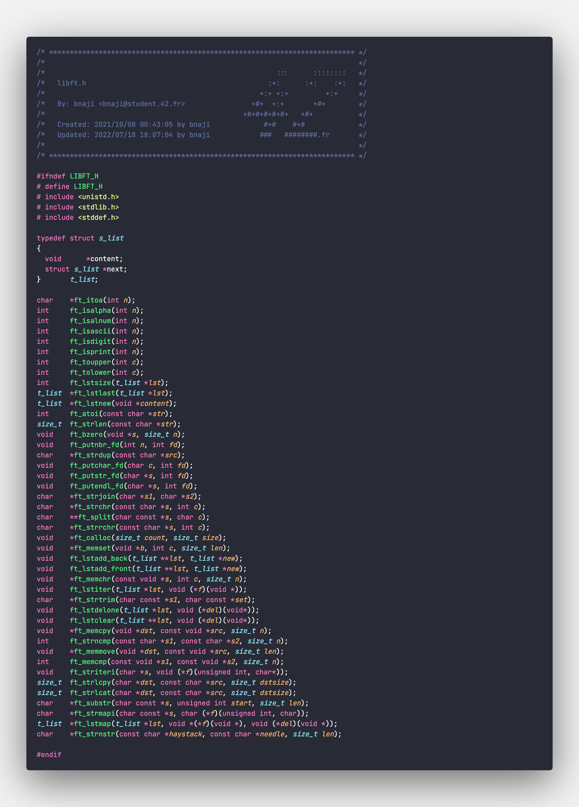

# Libft
## Introduction
This is a project that I've created to learn the basics of C. It's a library that I use to write my programs. It's the first project in 42 foundation. The objective of this project is to introduce us to the basics of C and give us the opportunity to build our own custom library. This includes the following:
- []: # C Syntaxes
- []: # Allocting in heap and Freeing
- []: # structures and linked lists
- []: # Header files
- []: # Makefile

